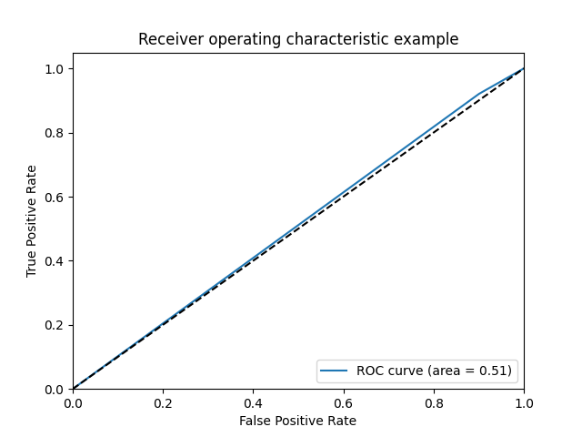
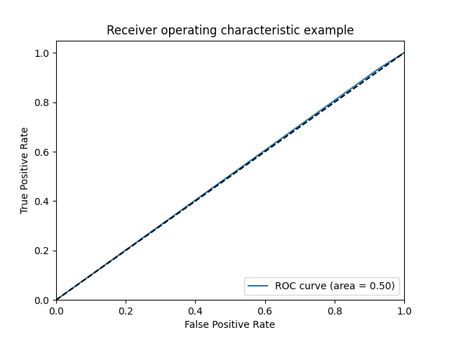
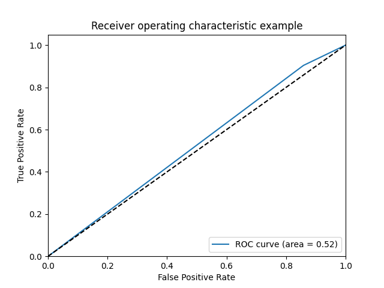

# AnomalyWatchdog

```bash
Baseline: run videollama for yes or no answer to determine whether a given video contains unusual activities, get the baseline numbers for the oops datasets Get the baseline number with VLM
Baseline with vision-only model
For the videos that were detected as unusual, ask for the “why? Question” / “describe why this video is unusual” in a separate exp.
(oops dataset paper has a pre-trained model that can be used as another baseline)
```
## Notes
- Some videollama_outputs does not have yes/no in them. Those videos were annotated as 'na'
- Those videos were filtered out before the evaluation.


## Experiment table 1 (Audio+visual features)
| Prompt|filtered videos|tp|tn|Precision | Recall | F1| Auc-roc|
| ---|---  |---|--- |--- |---|---|---|
|1.  "Does this video contain any unusual activities? Please reply Yes or No only."| 4356/4711| 2528|117|0.62|0.94|0.75|0.5|
|2.  "Let's look at this video frame by frame. Does this video contain any unusual activities? Please reply Yes or No only."|4490/4711 |2369|314 |0.63|0.94|0.75|0.52|
<!--  -->
<div style="display: flex; justify-content: space-between;">
  <div style="flex: 1; padding-right: 5px;">
  
  </div>
    <div style="flex: 1; padding-right: 5px;">
  
  </div>
</div>


## Experiment table 2 (Only Visual features w/o audio)
<!-- tp: 2025
tn: 458
auc_roc_curve: 0.5183118745612152
precision: 0.63, recall: 0.76, f1_score: 0.69, support: None -->
| Prompt|filtered videos|tp|tn|Precision | Recall | F1| Auc-roc|
| ---|---  |---|--- |--- |---|---|---|
|1.  "Does this video contain any unusual activities? Please reply Yes or No only."|4317/4711 | 2025|458 |0.63|0.76|0.69|0.52|
|2.  "Let's look at this video frame by frame. Does this video contain any unusual activities? Please reply Yes or No only."|4290/4711|1765|650 |0.64|0.66|0.65|0.53|

<!-- precision: 0.64, recall: 0.66, f1_score: 0.65, support: None
tp: 1765
tn: 650
auc_roc_curve: 0.5311649750777898 -->
<div style="display: flex; justify-content: space-between;">
  <div style="flex: 1; padding-right: 5px;">
    
  </div>
  <div style="flex: 1; padding-right: 5px;">
    
  </div>
</div>
