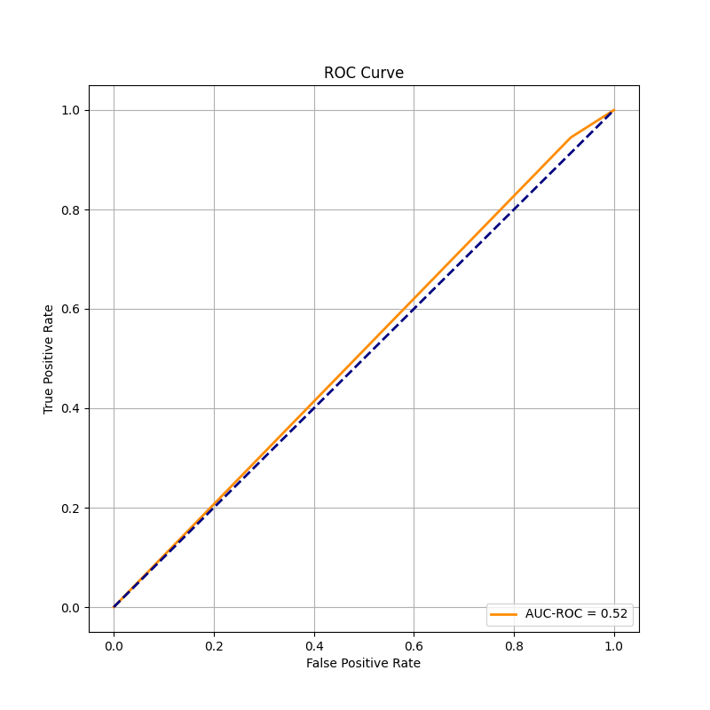

# AnomalyWatchdog

```
Baseline: run videollama for yes or no answer to determine whether a given video contains unusual activities, get the baseline numbers for the oops datasets Get the baseline number with VLM
Baseline with vision-only model
For the videos that were detected as unusual, ask for the “why? Question” / “describe why this video is unusual” in a separate exp.
(oops dataset paper has a pre-trained model that can be used as another baseline)
```

**Experiment1**

- Prompt: "Does this video contain any unusual activities? Please reply Yes or No only."
- ground truth: total failure videos: 2906, total not failure videos: 1805, total videos: 4711
- Some videollama_outputs does not have yes/no in them.
  - Filtered out videos that has "yes" or "no" in videollama output (346)
  - Total filtered videos: 4365
- Evaluation:

  - tp: 2528
  - tn: 105 (performed bad)
  - Total videos: 4365
  - Precision: 0.62
  - Recall: 0.94
  - F1 Score: 0.74
  - AUC-ROC: 0.5
  - Average Precision (AP): 0.62
    

**Experiment 2**

- Prompt: ""Let's look at this video frame by frame. Does this video contain any unusual activities? Please reply Yes or No only.""
- ground truth: total failure videos: 2906, total not failure videos: 1805, total videos: 4711
- Some videollama_outputs does not have yes/no in them.
  - Filtered out videos that has "yes" or "no" in videollama output (670)
  - Total filtered videos: 4041
- Evaluation:

  - tp: 2350
  - tn: 113 (performed bad)
  - Total videos: 4041
  - Precision: 0.63
  - Recall: 0.93
  - F1 Score: 0.75
  - AUC-ROC: 0.5
  - Average Precision (AP): 0.63
    
